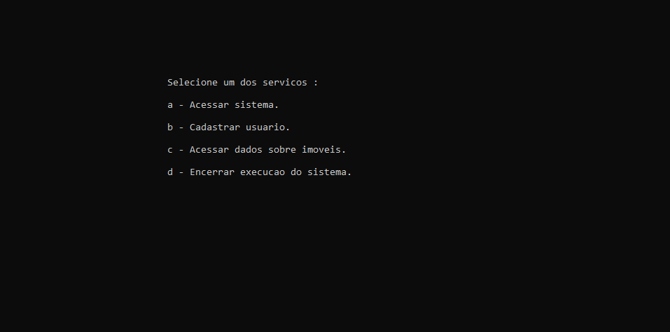
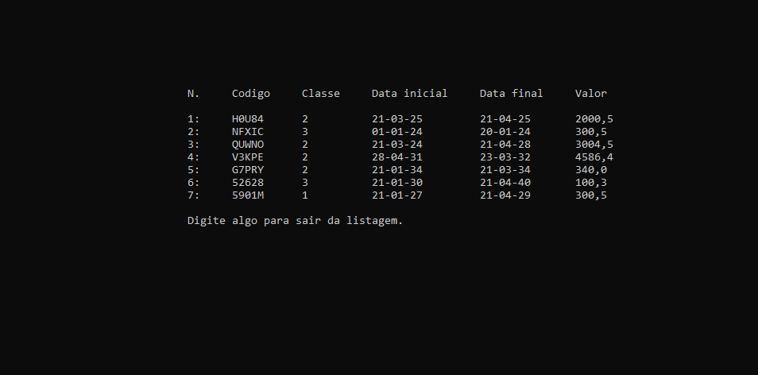
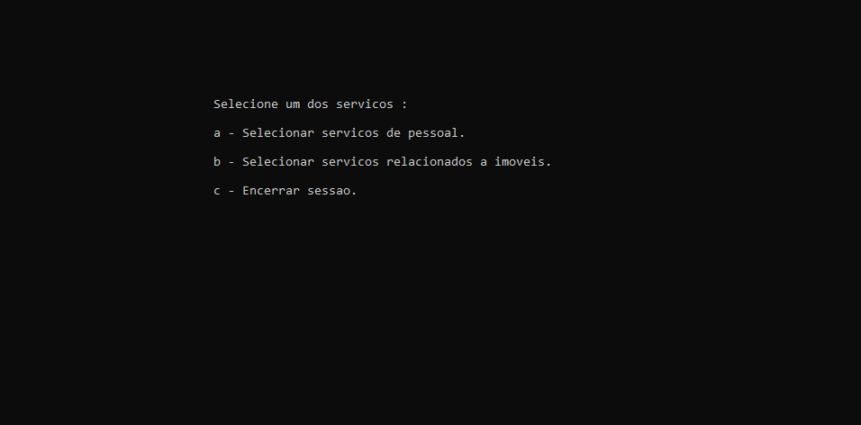

# T2 (TP1 - 2020.2): Sistema de Imóveis
 Trabalho 2 de Técnicas de Programação (TP1), disciplina ofertada na Universidade de Brasília (UnB) no semestre 2020.2. 

## Funcionalidades do sistema

O sistema de software desenvolvido neste projeto tem por objetivo prover suporte ao aluguel de imóveis. Para tanto, é necessário que usuários tenham acesso ao serviço (tanto proprietáros como locadores), podendo anunciar imóveis (apartamento, casa ou quarto).

O programa permite que usuários se cadastrem, listem os imóveis e as propostas de aluguel, façam proposta, cadastrem imóveis, editem as informações de imóveis e propostas cadastrados, bem como exclua propostas e imóveis. Também permite gerenciar as informações de usuário, editando-as e excluindo-as.

## Arquitetura adotada

O estilo de arquitetura em camadas foi adotado no desenvolvimento do sistema, que é composto por camada de apresentação e camada de serviço. A camada de apresentação lida com a interface com o usuário, enquanto a cama de serviço lida com a implementação das funcionalidades.

O sistema apresenta persistência, que é implementada na camada de serviço para simplificação. A persistência é feita através de banco de dados SQLite.

O sistema também é modularizado, com cada camada sendo composta de diferentes módulos que lidam com diferentes funções.

Uma descrição detalhada das camadas e dos módulos pode ser encontrada em ArquiteturaDeSoftwareDescricao.txt e ArquiteturaDeSoftware.pdf.

## Documentação

A documentação foi feita usando o Doxygen. Nela, estão detalhes sobre os domínios e entidades, como o que é necessário que um e-mail tenha para ser considerado válido, uma senha, um nome, um código etc., bem como o que compõe cada entidade (grupo de domínios) do sistema. Pode ser acessada através do arquivo index.html dentro da pasta doxygen.

O sistema é composto dos domínios código, classe, descrição, endereço, data, número, moeda, nome, e-mail, senha e telefone. Já as entidades são imóvel, proposta e usuário.

## Teste fumaça

O teste fumaça compreende cada uma das funcionalidades do sistema, resultando em um total de 16 testes individuais detalhados no arquivo TesteFumaca.pdf. Foram feitos apenas testes de casos de sucesso.

## Compilação

O projeto foi desenvolvido no ambiente Code::Blocks. Portanto, sua execução depende que o programa seja compilado nesse ambiente. A compilação deve ser feita a partir do arquivo tp1-t2.cbp.

## Interface com usuário

A interface com o usuário é feita através do terminal com telas para cada um dos serviços implementados. O usuário pode navegar no sistema digitando teclas no terminal.

Abaixo, capturas de algumas telas do programa.

## License
[MIT](https://choosealicense.com/licenses/mit/)
